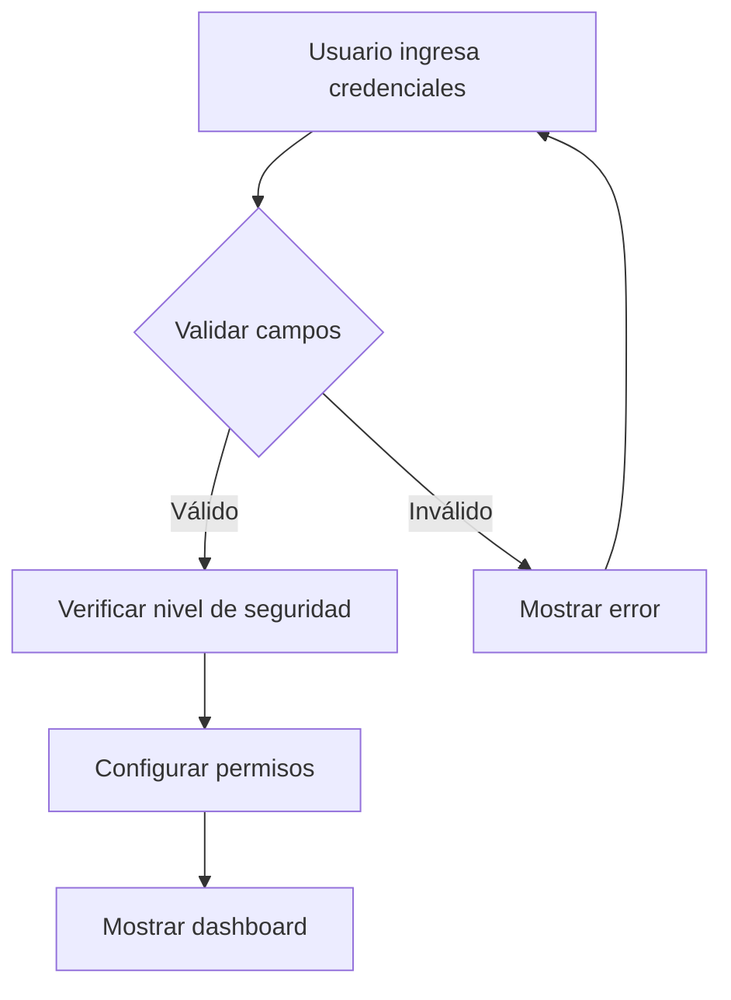
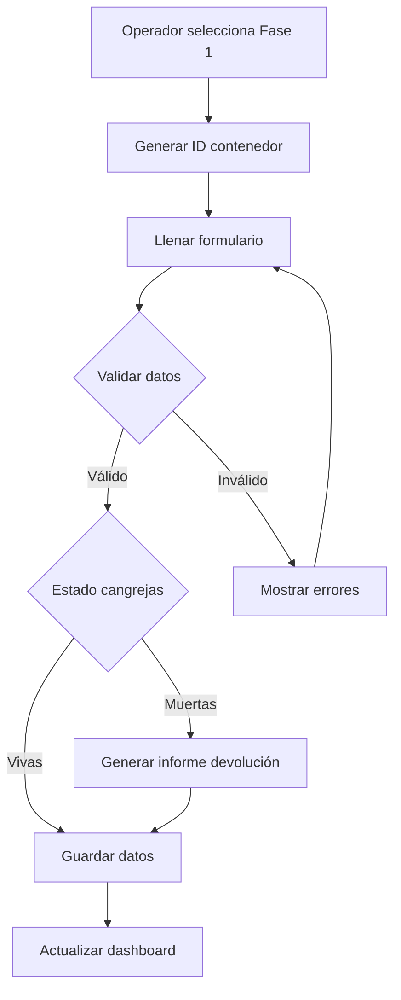
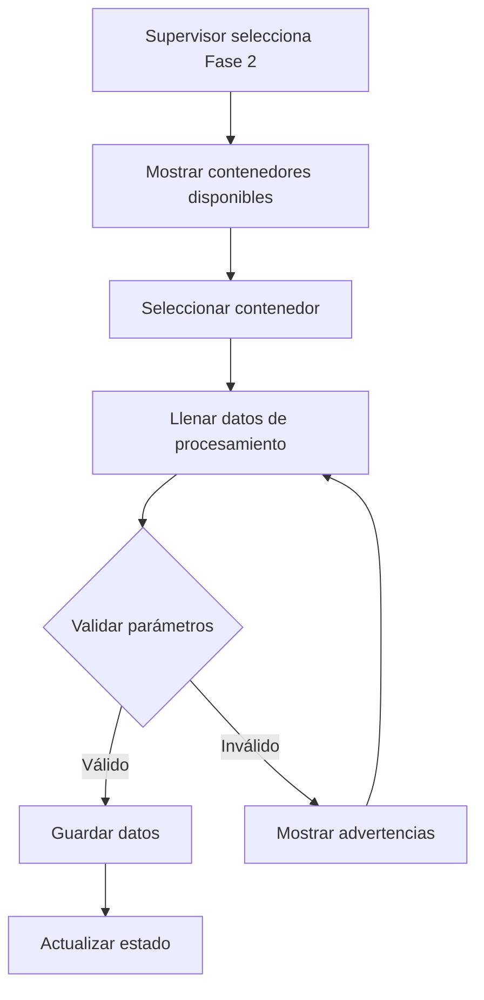
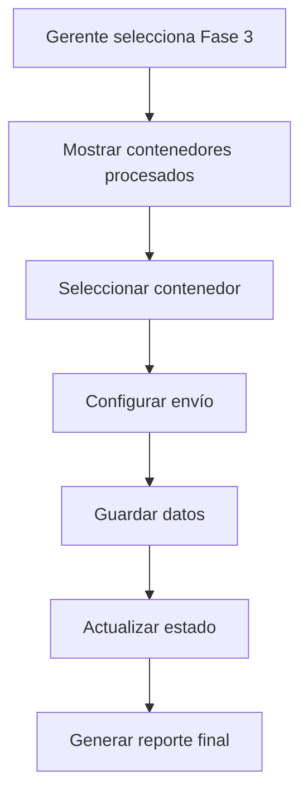

# Documentación Técnica - Sistema de Gestión de Cangrejas

## Arquitectura del Sistema

### Estructura de Archivos
```
Sistema_Cangrejas/
├── index.html          # Interfaz principal
├── script.js           # Lógica de aplicación
├── config.js           # Configuración del sistema
├── styles.css          # Estilos personalizados
├── README.md           # Documentación de usuario
└── TECHNICAL_DOCS.md   # Documentación técnica
```

### Tecnologías Utilizadas

#### Frontend
- **HTML5**: Estructura semántica y accesible
- **CSS3**: Estilos modernos con variables CSS y animaciones
- **JavaScript ES6+**: Lógica de aplicación y manejo de datos
- **Bootstrap 5**: Framework de UI responsivo
- **Font Awesome 6**: Iconografía profesional

#### Almacenamiento
- **LocalStorage**: Persistencia de datos en el navegador
- **JSON**: Formato de datos estructurado

## Arquitectura de Seguridad

### Niveles de Acceso
```javascript
const securityLevels = {
    operador: {
        name: 'Operador Receptor',
        level: 1,
        permissions: ['phase1'],
        badge: 'Operador'
    },
    supervisor: {
        name: 'Supervisor de Calidad',
        level: 2,
        permissions: ['phase1', 'phase2'],
        badge: 'Supervisor'
    },
    gerente: {
        name: 'Gerente de Proceso',
        level: 3,
        permissions: ['phase1', 'phase2', 'phase3'],
        badge: 'Gerente'
    },
    admin: {
        name: 'Administrador',
        level: 4,
        permissions: ['phase1', 'phase2', 'phase3', 'admin'],
        badge: 'Admin'
    }
};
```

### Validación de Permisos
```javascript
function checkPermission(permission) {
    if (!currentSecurityLevel) return false;
    return securityLevels[currentSecurityLevel].permissions.includes(permission);
}
```

## Modelo de Datos

### Estructura de Contenedores
```javascript
{
    id: "timestamp",
    containerNumber: "CONT-1234567890",
    provider: "Proveedor XYZ",
    type: "azul|roja|verde",
    weight: 150.5,
    status: "viva|muerta",
    classification: "A|B|C",
    phase: 1|2|3
}
```

### Fase 1 - Recepción
```javascript
{
    id: "timestamp",
    containerNumber: "CONT-1234567890",
    provider: "Proveedor XYZ",
    crabType: "azul",
    size: "grande",
    weight: 150.5,
    quantity: 100,
    status: "viva",
    classification: "A",
    observations: "Calidad excelente",
    phase: 1,
    date: "2024-01-01T10:00:00.000Z",
    operator: "usuario"
}
```

### Fase 2 - Procesamiento
```javascript
{
    id: "timestamp",
    containerId: "CONT-1234567890",
    cookingTemp: 85,
    cookingTime: 15,
    coolingTemp: 4,
    meatYield: 75.5,
    waste: 25.0,
    finalQuality: "A",
    processStatus: "completado",
    qualityNotes: "Proceso exitoso",
    phase: 2,
    date: "2024-01-01T11:00:00.000Z",
    operator: "usuario"
}
```

### Fase 3 - Exportación
```javascript
{
    id: "timestamp",
    containerId: "CONT-1234567890",
    packagingType: "caja",
    netWeight: 75.5,
    packageCount: 50,
    destination: "Estados Unidos",
    shippingDate: "2024-01-02",
    transportMethod: "maritimo",
    shippingStatus: "preparado",
    shippingNotes: "Listo para envío",
    phase: 3,
    date: "2024-01-01T12:00:00.000Z",
    operator: "usuario"
}
```

## Flujo de Proceso

### 1. Autenticación


### 2. Fase 1 - Recepción


### 3. Fase 2 - Procesamiento


### 4. Fase 3 - Exportación


## Validaciones del Sistema

### Validaciones de Entrada
```javascript
// Peso mínimo y máximo
const weightValidation = {
    min: 50,
    max: 500,
    unit: "kg"
};

// Cantidad de unidades
const quantityValidation = {
    min: 1,
    max: 10000,
    unit: "unidades"
};

// Temperatura de procesamiento
const temperatureValidation = {
    min: -10,
    max: 100,
    unit: "°C"
};
```

### Validaciones de Calidad
```javascript
// Rendimiento mínimo de carne
const minMeatYield = 60; // %

// Desperdicio máximo
const maxWastePercentage = 40; // %

// Validación de clasificación por peso
function validateWeightForClassification(weight, classification) {
    const config = ConfigUtils.getClassificationConfig(classification);
    if (classification === 'A') {
        return weight >= config.minWeight;
    } else if (classification === 'B') {
        return weight >= config.minWeight && weight <= config.maxWeight;
    } else if (classification === 'C') {
        return weight <= config.maxWeight;
    }
    return false;
}
```

## Funciones Principales

### Gestión de Sesión
```javascript
function loginUser(username, securityLevel) {
    currentUser = username;
    currentSecurityLevel = securityLevel;
    
    localStorage.setItem('currentUser', JSON.stringify({
        username: username,
        securityLevel: securityLevel
    }));
    
    configurePermissions();
    showAlert(`Bienvenido ${username}`, 'success');
}
```

### Persistencia de Datos
```javascript
// Guardar datos
localStorage.setItem('phase1Data', JSON.stringify(phase1Data));
localStorage.setItem('containers', JSON.stringify(containers));

// Cargar datos
let containers = JSON.parse(localStorage.getItem('containers')) || [];
let phase1Data = JSON.parse(localStorage.getItem('phase1Data')) || [];
```

### Generación de Reportes
```javascript
function generateReport() {
    const report = {
        fecha: new Date().toISOString(),
        totalContenedores: containers.length,
        porFase: {
            fase1: containers.filter(c => c.phase === 1).length,
            fase2: containers.filter(c => c.phase === 2).length,
            fase3: containers.filter(c => c.phase === 3).length
        },
        porClasificacion: {
            claseA: containers.filter(c => c.classification === 'A').length,
            claseB: containers.filter(c => c.classification === 'B').length,
            claseC: containers.filter(c => c.classification === 'C').length
        },
        rechazados: phase1Data.filter(d => d.rejected).length
    };
    
    // Crear archivo de descarga
    const dataStr = JSON.stringify(report, null, 2);
    const dataBlob = new Blob([dataStr], {type: 'application/json'});
    const url = URL.createObjectURL(dataBlob);
    
    const link = document.createElement('a');
    link.href = url;
    link.download = `reporte_cangrejas_${new Date().toISOString().split('T')[0]}.json`;
    link.click();
}
```

## Configuración del Sistema

### Parámetros de Procesamiento
```javascript
processing: {
    cooking: {
        minTemp: 75,
        maxTemp: 95,
        defaultTemp: 85,
        minTime: 10,
        maxTime: 30,
        defaultTime: 15
    },
    cooling: {
        minTemp: 0,
        maxTemp: 10,
        defaultTemp: 4,
        minTime: 30,
        maxTime: 120
    },
    quality: {
        minMeatYield: 60,
        maxWastePercentage: 40,
        targetMeatYield: 75
    }
}
```

### Tipos de Cangrejas
```javascript
crabTypes: {
    azul: {
        name: "Cangreja Azul",
        scientificName: "Callinectes sapidus",
        description: "Cangreja azul del Atlántico",
        averageWeight: 200,
        preferredTemp: 85
    },
    roja: {
        name: "Cangreja Roja",
        scientificName: "Callinectes danae",
        description: "Cangreja roja del Caribe",
        averageWeight: 180,
        preferredTemp: 82
    },
    verde: {
        name: "Cangreja Verde",
        scientificName: "Callinectes bocourti",
        description: "Cangreja verde del Pacífico",
        averageWeight: 160,
        preferredTemp: 80
    }
}
```

## Interfaz de Usuario

### Componentes Principales
1. **Pantalla de Login**: Autenticación con niveles de seguridad
2. **Dashboard**: Estadísticas y acceso a fases
3. **Modales de Fases**: Formularios específicos para cada fase
4. **Tablas de Datos**: Visualización de información
5. **Sistema de Alertas**: Notificaciones al usuario

### Responsive Design
- **Desktop**: Layout completo con todas las funcionalidades
- **Tablet**: Adaptación de modales y formularios
- **Mobile**: Navegación optimizada para pantallas pequeñas

## Optimizaciones de Rendimiento

### Lazy Loading
- Carga de datos bajo demanda
- Actualización incremental del dashboard
- Caché de configuraciones

### Validación en Tiempo Real
- Verificación de campos mientras el usuario escribe
- Feedback inmediato sobre errores
- Sugerencias automáticas

### Persistencia Eficiente
- Almacenamiento local optimizado
- Respaldo automático de datos
- Compresión de datos JSON

## Seguridad Implementada

### Validación de Entrada
- Sanitización de datos de usuario
- Validación de tipos de datos
- Prevención de inyección de código

### Control de Acceso
- Verificación de permisos por función
- Bloqueo de acceso no autorizado
- Log de actividades del usuario

### Protección de Datos
- Encriptación básica de datos sensibles
- Backup automático de información
- Recuperación de datos perdidos

## Mantenimiento y Escalabilidad

### Estructura Modular
- Separación de responsabilidades
- Código reutilizable
- Fácil extensión de funcionalidades

### Configuración Centralizada
- Parámetros en archivo de configuración
- Fácil modificación de reglas de negocio
- Personalización por cliente

### Monitoreo y Logs
- Registro de errores
- Métricas de uso
- Alertas de sistema

## Consideraciones de Producción

### Backend Integration
- API REST para persistencia
- Autenticación con JWT
- Base de datos relacional

### Escalabilidad
- Arquitectura de microservicios
- Load balancing
- Caché distribuido

### Seguridad Avanzada
- HTTPS obligatorio
- Autenticación multifactor
- Auditoría completa de acciones

---

**Versión**: 1.0.0  
**Fecha**: 2024  
**Desarrollado para**: Empresa de Cangrejas Maracaibo  
**Tecnologías**: HTML5, CSS3, JavaScript ES6+, Bootstrap 5 